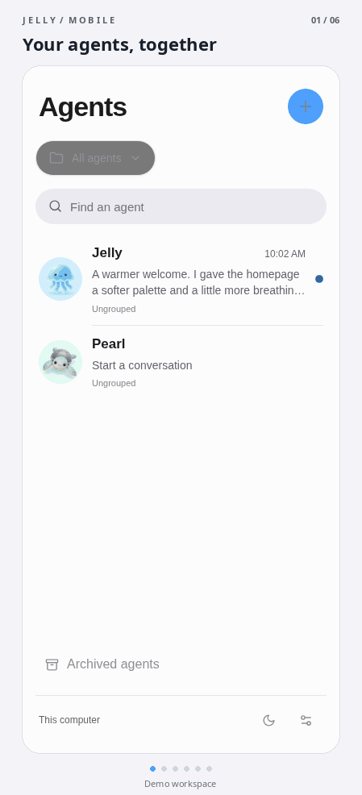

# Jelly

<p align="center">
  
</p>

A local-first workspace for persistent AI agents. Give each agent a name, instructions, and a project folder, then chat through a simple web interface.

Built with Bun, React, SQLite, and the [Pi agent harness](https://github.com/earendil-works/pi).

- Persistent conversations, project workspaces, and background agent runs
- File editing, shell tools, subagents, and MCP connections
- Browser control with private sign-in handoffs; Linux desktop support
- File uploads, inline images, and downloadable artifacts
- ChatGPT subscription or OpenAI API access, plus a no-key local demo

## Quick start

Requires [Bun](https://bun.sh) **1.3.9+** and **Node.js 24+** (for subagent runners and CLI dependencies). Linux is required for the managed browser desktop and sudo handoffs.

```sh
git clone https://github.com/dctanner/jelly.git
cd jelly
bun install
bun run dev
```

Open **http://127.0.0.1:5173**. Without credentials, Jelly uses a labeled, scripted local demo. Connect ChatGPT or add an OpenAI API key in Settings for real model responses. Model availability depends on your account.

Optional environment settings are documented in [`.env.example`](.env.example). Put local values in `.env.local`, which is ignored by Git. Set `FIRECRAWL_API_KEY` to enable web search and fetching.

### Production

```sh
bun run build
bun start
```

Open **http://127.0.0.1:3100**. Stop development first; both modes use API port 3100 by default. Production has no hot reload—restart after code changes when agents are idle. Development backend reloads interrupt active runs; set `JELLY_WATCH_API=0` to disable them.

### Optional browser desktop

On Debian/Ubuntu x86-64, with Google Chrome or Chromium already installed:

```sh
bun run setup:desktop
```

Set `JELLY_BROWSER_PATH` if the browser is outside its usual system location.

## Security and local data

**Jelly is a trusted-user tool, not a sandbox.** Agents can execute shell commands and access files with your OS user's permissions, without per-tool approval. Sudo commands run immediately when your policy permits; otherwise Jelly requests private authentication.

Keep Jelly on loopback or a trusted Tailscale network. Do not expose it directly to the public internet. Anyone with network access to the app may gain control of its tools. `bun run dev:tailscale` enables private tailnet access.

Conversations, credentials, browser profiles, and artifacts live in `.jelly/` by default. User-wide MCP configuration and OAuth caches live in `~/.jelly/`. Neither belongs in source control. Stop Jelly before backing up its instance data. Model conversations are sent to your chosen provider; local storage does not mean local inference.

## Development

```sh
bun run check   # TypeScript, tests, and production build
```

Tests use temporary data and deterministic fixtures; no paid model calls are required. See [architecture](docs/ARCHITECTURE.md), [design](docs/DESIGN.md), and the [roadmap](ROADMAP.md).

## License

[MIT](LICENSE). Bundled fonts and dependencies retain their own licenses, including noVNC (MPL-2.0).
